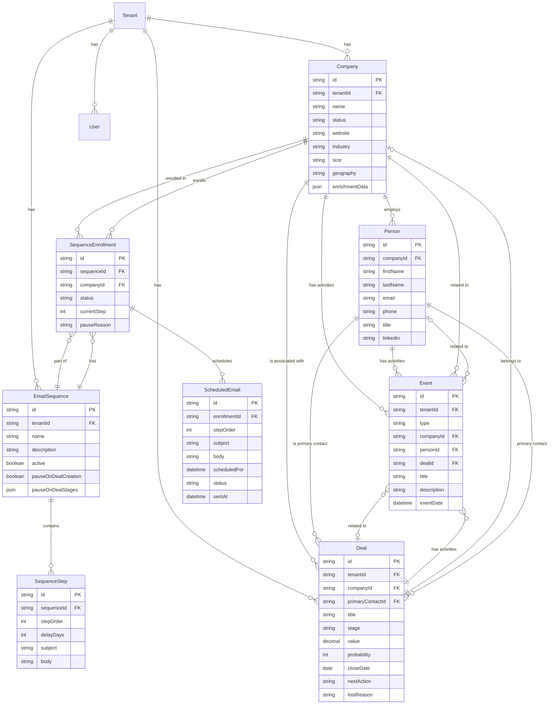
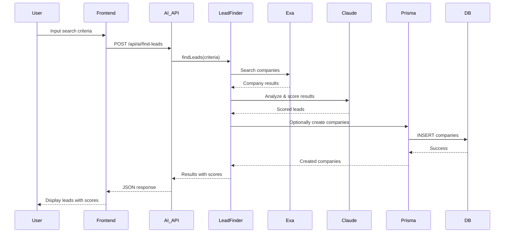
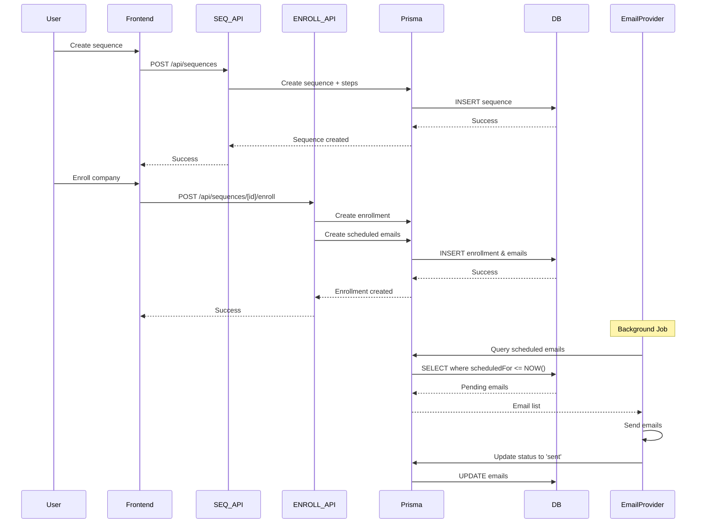
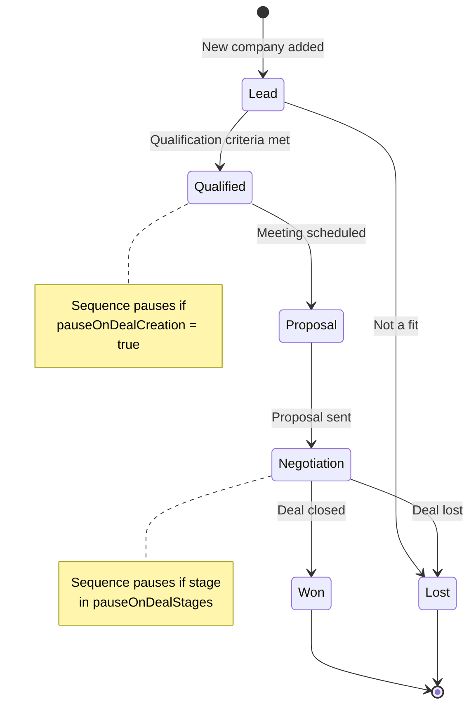
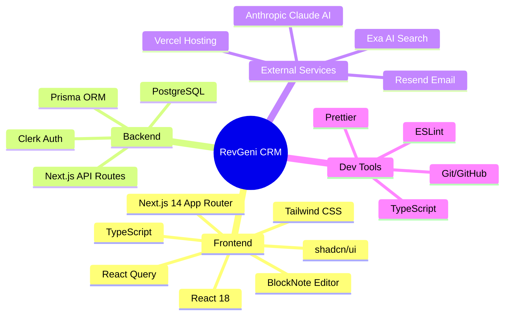
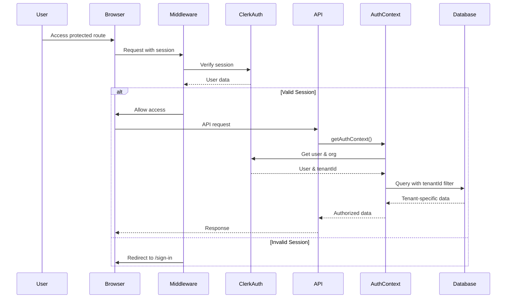

# System Architecture Diagram

## High-Level Architecture

```mermaid
graph TB
    subgraph "External Services"
        CLERK[Clerk Auth]
        EXA[Exa AI API]
        ANTHROPIC[Anthropic Claude API]
        EMAIL[Email Provider]
    end

    subgraph "Frontend - Next.js 14 App Router"
        PAGES[React Pages/Components]
        UI[UI Components<br/>shadcn/ui + BlockNote]
        RQ[React Query<br/>State Management]
    end

    subgraph "API Layer - Next.js Route Handlers"
        AUTH[Auth Context<br/>/lib/auth/context]
        COMPANIES_API[/api/companies]
        DEALS_API[/api/deals]
        PEOPLE_API[/api/people]
        SEQUENCES_API[/api/sequences]
        EVENTS_API[/api/events]
        AI_API[/api/ai/*]
        WEBSETS_API[/api/websets/*]
        ANALYTICS_API[/api/analytics]
    end

    subgraph "Business Logic Layer"
        LEAD_FINDER[AI Lead Finder<br/>/lib/ai/find-leads]
        SEQUENCE_GEN[Sequence Generator<br/>/lib/ai/generate-sequence]
        WEBSETS[Exa Websets<br/>/lib/ai/exa-websets]
        ENRICHMENT[Data Enrichment]
    end

    subgraph "Data Layer"
        PRISMA[Prisma ORM]
        DB[(PostgreSQL<br/>Database)]
    end

    %% Frontend connections
    PAGES --> UI
    PAGES --> RQ
    RQ --> COMPANIES_API
    RQ --> DEALS_API
    RQ --> PEOPLE_API
    RQ --> SEQUENCES_API
    RQ --> EVENTS_API
    RQ --> AI_API
    RQ --> WEBSETS_API
    RQ --> ANALYTICS_API

    %% API to Auth
    COMPANIES_API --> AUTH
    DEALS_API --> AUTH
    PEOPLE_API --> AUTH
    SEQUENCES_API --> AUTH
    EVENTS_API --> AUTH
    AI_API --> AUTH
    WEBSETS_API --> AUTH
    ANALYTICS_API --> AUTH

    %% API to Business Logic
    AI_API --> LEAD_FINDER
    AI_API --> SEQUENCE_GEN
    WEBSETS_API --> WEBSETS
    COMPANIES_API --> ENRICHMENT

    %% Business Logic to External Services
    LEAD_FINDER --> EXA
    LEAD_FINDER --> ANTHROPIC
    SEQUENCE_GEN --> ANTHROPIC
    WEBSETS --> EXA
    SEQUENCES_API --> EMAIL

    %% Auth to Clerk
    AUTH --> CLERK

    %% API to Data Layer
    COMPANIES_API --> PRISMA
    DEALS_API --> PRISMA
    PEOPLE_API --> PRISMA
    SEQUENCES_API --> PRISMA
    EVENTS_API --> PRISMA
    AI_API --> PRISMA
    WEBSETS_API --> PRISMA
    ANALYTICS_API --> PRISMA

    %% Data Layer
    PRISMA --> DB

    style CLERK fill:#4F46E5
    style EXA fill:#10B981
    style ANTHROPIC fill:#F59E0B
    style EMAIL fill:#EF4444
    style DB fill:#3B82F6
```

## Data Model Architecture



## Feature Flow: AI Lead Finder



## Feature Flow: Email Sequences



## Feature Flow: Deal Pipeline



## Component Architecture

```mermaid
graph LR
    subgraph "Page Components (Server)"
        COMP_PAGE[/companies/id/page.tsx]
        DEAL_PAGE[/deals/id/page.tsx]
        SEQ_PAGE[/sequences/id/page.tsx]
        PEOPLE_PAGE[/people/id/page.tsx]
    end

    subgraph "Client Components"
        COMP_TABS[CompanyTabs]
        DEAL_STAGE[StageUpdater]
        SEQ_ENROLL[EnrollmentCard]
        SEQ_STEPS[EmailStepsSection]
        BLOCKNOTE[BlockNoteViewer]
    end

    subgraph "UI Components"
        BUTTON[Button]
        CARD[Card]
        BADGE[Badge]
        TABLE[Table]
        DIALOG[Dialog]
    end

    subgraph "Shared Components"
        ACTIVITY[ActivityTimeline]
        BREADCRUMB[Breadcrumbs]
        QUICK_ACTIONS[QuickActions]
    end

    COMP_PAGE --> COMP_TABS
    COMP_PAGE --> ACTIVITY
    COMP_PAGE --> BREADCRUMB

    DEAL_PAGE --> DEAL_STAGE
    DEAL_PAGE --> ACTIVITY
    DEAL_PAGE --> QUICK_ACTIONS

    SEQ_PAGE --> SEQ_ENROLL
    SEQ_PAGE --> SEQ_STEPS
    SEQ_STEPS --> BLOCKNOTE

    PEOPLE_PAGE --> ACTIVITY
    PEOPLE_PAGE --> QUICK_ACTIONS

    COMP_TABS --> BUTTON
    COMP_TABS --> CARD
    DEAL_STAGE --> BADGE
    SEQ_ENROLL --> DIALOG

    style COMP_PAGE fill:#E0E7FF
    style DEAL_PAGE fill:#E0E7FF
    style SEQ_PAGE fill:#E0E7FF
    style PEOPLE_PAGE fill:#E0E7FF

    style COMP_TABS fill:#DBEAFE
    style DEAL_STAGE fill:#DBEAFE
    style SEQ_ENROLL fill:#DBEAFE
    style SEQ_STEPS fill:#DBEAFE
    style BLOCKNOTE fill:#DBEAFE
```

## Technology Stack



## Authentication & Authorization Flow



